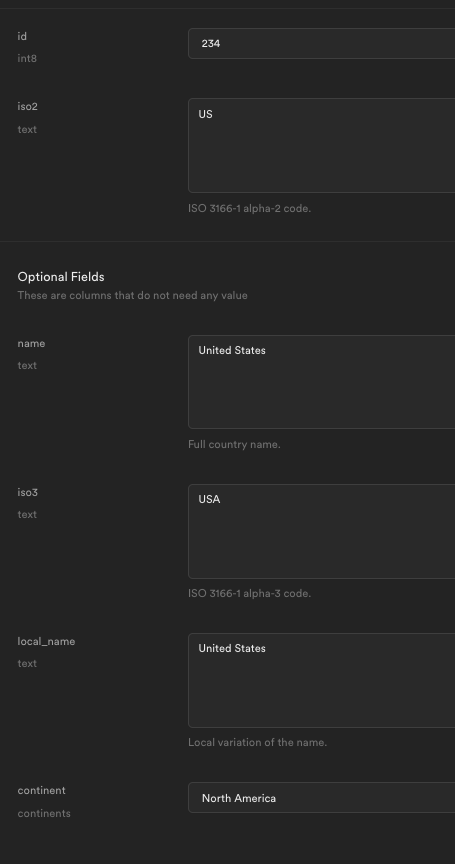

# Search Countries

Build a countries search page

See [demo app](https://alchemycodelab.github.io/solutions-web/countries/)

## Setup

Use [this template](https://github.com/alchemycodelab/web-finish-countries) for this deliverable.

Use the information below to guide you:

-   Finish Steps
-   Data Model
-   App Requirements
-   Work Incrementally
-   Rubric

## Finish Steps

### Part A

Load and display basic country data:

-   `getCountries` service call in `fetch-utils.js`
-   Import, load event, findCountries, displayCountries in `app.js`

### Part B

Populate continents dropdown:

-   `getContinents` service call in `fetch-utils.js`
-   Import, load event, displayContinentOptions

### Part C

Search Countries:

-   Add query logic in `getCountries` in `fetch-utils.js`
-   Form event, findCountries in `app.js`

### Part D

Show Counts:

-   Add query logic in `getCountries` in `fetch-utils.js`
-   findCountries, displayNotifications in `app.js`

## Data Model

Here is the model for the `countries` table:

In addition to the table, there is a view you can use to get attributes for dropdown lists:

| Attribute | View name            | Object structure            |
| --------- | -------------------- | --------------------------- |
| continent | `country_continents` | `{ name: 'North America' }` |

## App Requirements

Present a search form to the user and shows a list of up to the first 100 countries that match the search.

Search on:

| Attribute | Search                            |
| --------- | --------------------------------- |
| name      | `` .ilike('name', `%${name}%`) `` |
| continent | `.eq('continent', continent)`     |

## Work Incrementally

Build out your project step by step, this is **not** an exercise in changing variable names!

## Rubric

The following is required for your assignment to be graded:

-   PR open from `dev` to `main`
-   PR Passes CI (lint + tests)
-   PR preview on netlify

| Commits with working...             | **10** |
| ----------------------------------- | ------ |
| Part A: Display countries           | 3      |
| Part B: Populate continent dropdown | 2      |
| Part C: Search                      | 3      |
| Part D: Display Counts              | 2      |
